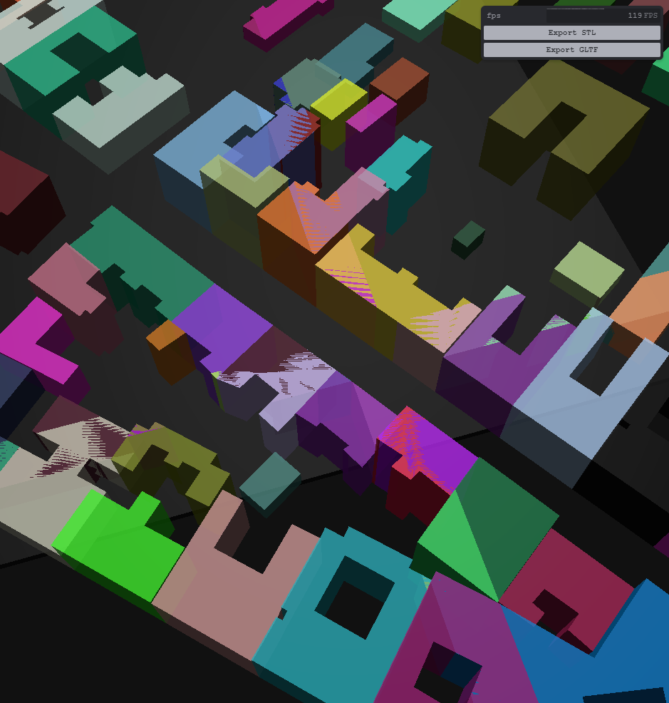
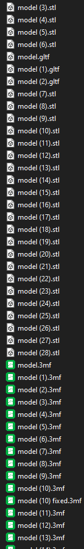
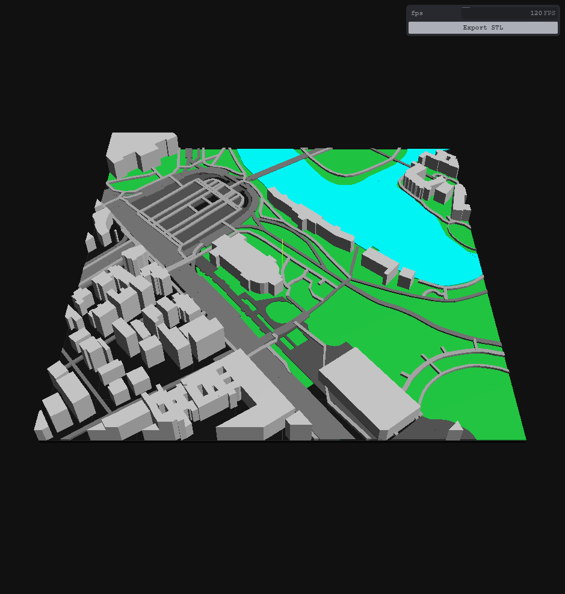
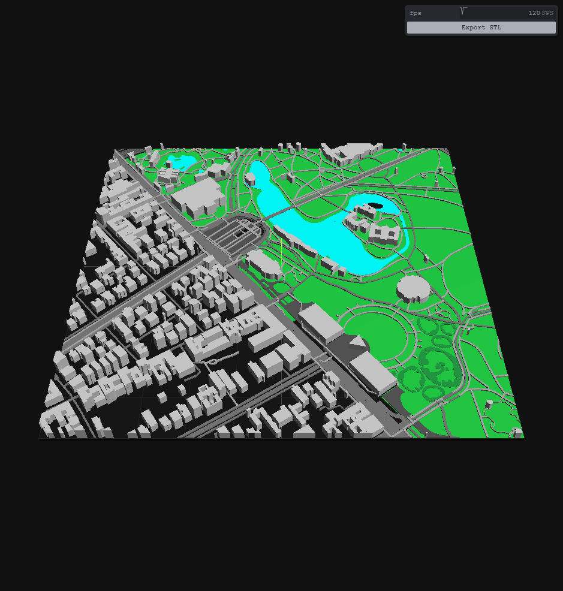
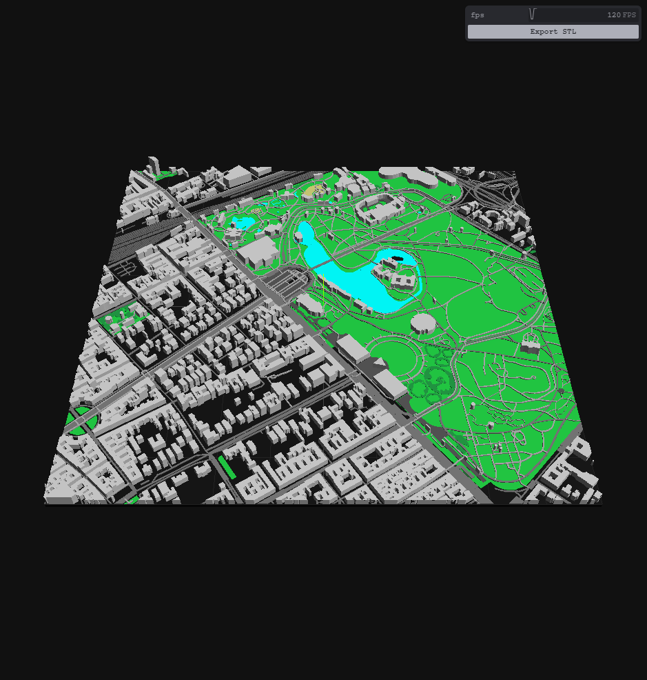
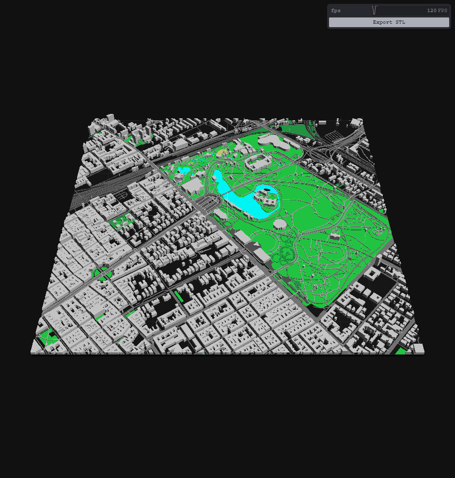
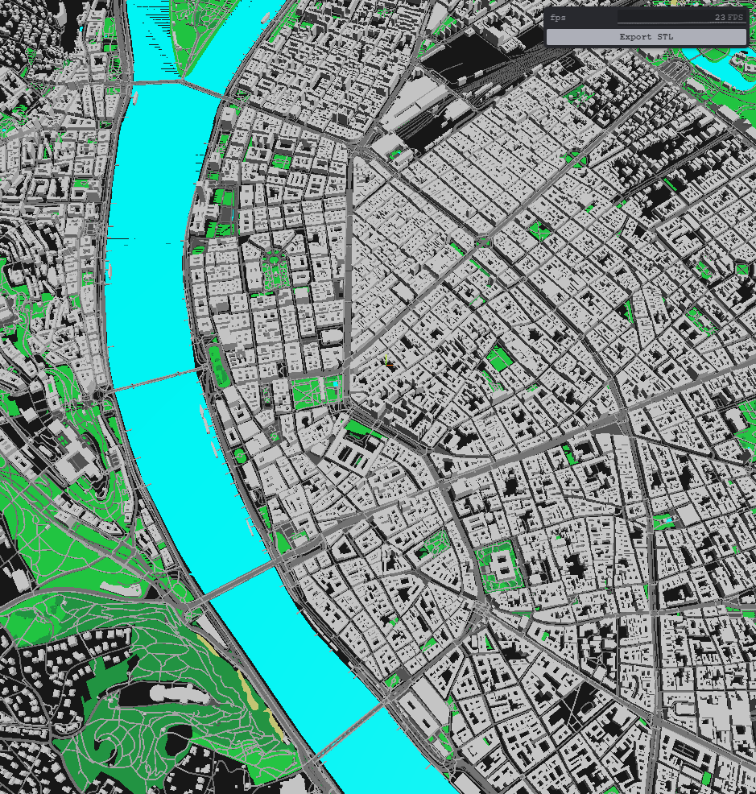
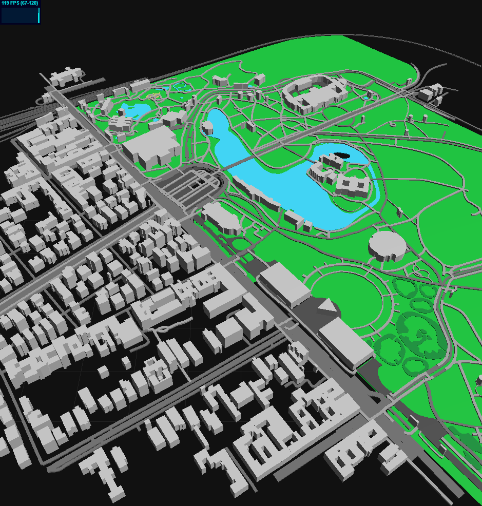
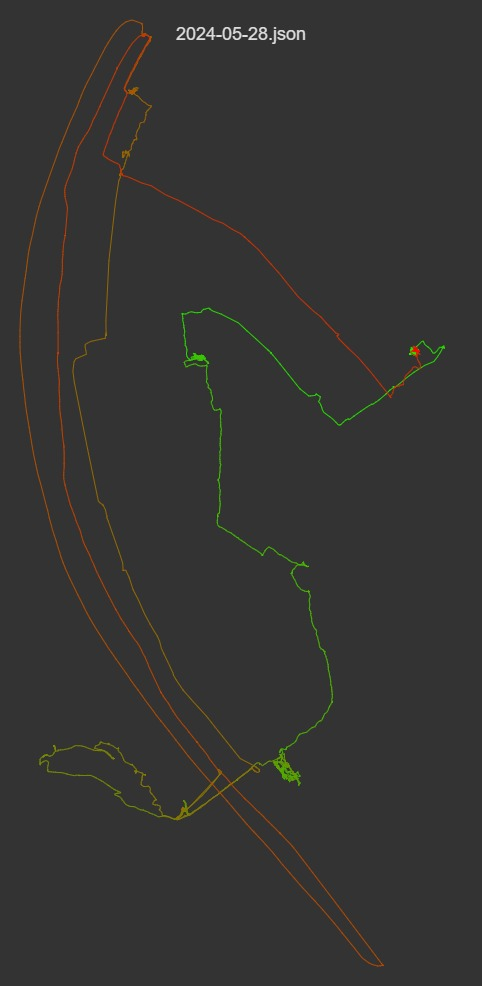
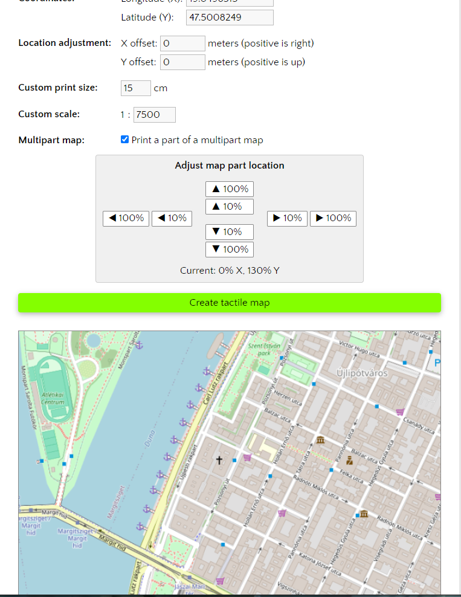

# Devlog

## 24w28

### union glitches
- huge ideas on increasing CSG performance
- vector tile overlap is still a huge issue for it though, causing many artifacts
- apparently, exactly matching geometry is no good for CSG addition

### first layer-optimized print
- printed 1:5k scale model, first one with layer height settings
- it's too thin, increase all the things 

### glitch debugging
- narrowed down objects to two overlapping buildings with glitching polygons
- couldn't find a solution to fix it using `three-bvh` 
- tried out `csg.js` with better results

### new libraries
- try `three-csg-ts` 
- performs better in high-precision unions
- suffers same non-manifold edges export issue
- discover `jscad` and `openjscad` 
- could be a great library for shared 2d/3d logic
- major rewrite to be done ...
- tried many, many variants and options with different frameworks
- also doesn't fix non-manifold, so just accepting it for now

## 24w...
- migrate to mapbox and implement all the things to support vector tiles directly

## 24w24..25-1

### elevation
- looking for elevation data
- nasa has 15 arcsec resolution tiffs
- tried some curls to get an idea of the data
- google lets you only query for single points
- stumbled upon vector tilesets, specifically mapbox
- elevation data in both RGB encoded but also contour lines
- contours could be really nice to print terrain in extruded layers

### new map data
- not satisfied with OSM map quality, looked for alternatives
- learned about mapbox and vector tiles in general
- great resources out there and widely supported standard
- mapbox data quality is fantastic, e.g. building heights
- mapbox-gl loads 3d models
- can they be accessed somehow? browser requests go to [https://api.mapbox.com/v4/mapbox.mapbox-bathymetry-v2,mapbox.mapbox-streets-v8,mapbox.mapbox-terrain-v2,mapbox.mapbox-models-v1/14/8295/5634.vector.pbf?sku=101lREwqwf5Rh&access_token=pk.eyJ1IjoiZXhhbXBsZXMiLCJhIjoiY2p0MG01MXRqMW45cjQzb2R6b2ptc3J4MSJ9.zA2W0IkI0c6KaAhJfk9bWg](this endpoint)
- the resulting `mvt` don't contain anything new
- the additional `gbl` that are being fetched contain roof geometry
- but no building facades, and i couldn't figure out where that's from
- so leaving it at simple extrusion geometry for now
- found `loaders.gl` for convenient MVT and GPX loaders
- zoom level of mvts automatically solves print detail issue

## 24w24-4
_view and layer scaling_

- implement separate scaling factors for rendering vs printing
- add setting for layer height
- migrate extrusion to use layer height setting

## 24w24-3 
_scaling, manifolds and gltf_

### scaling
- thinking about scale
- https://minicity.art/blog/whatisscale
- most trips max 5km x 5km
- 10k (city) / 7.5k (district) / 5k (block) / 2.5k (street)
- inputs: scale, tile size, bounding box
- outputs: tiles xy

### manifolds
- tried bvh-csg to combine all elements into one without non-manifold edges
- actually pretty confusing how the lib's supposed to be used
- managed to merge everything, but materials get lost along the way
- decide to merge for STL no-color export

### gltf
- add simple gltf export
- json only for now, not sure how to do glb
- works great though with colors and everything <3

## 24w24-2
_small parts_

- playing around with filtering tiny shapes that are not printable
- https://editor.p5js.org/gurki/sketches/Y7mPPOHFH
- conclude that it's best and easiest to just leave that to the slicer for now

## 24w24-1
_print settings and clipping_

- some more brainstorming on settings
- attempting clipping using custom csg
- lots of artifacts and non-manifold edges
- found three-bvh-csg, it's fabulous
- clipping works great
- refatoring a bit
- live on github

## 24w23-7
_overpass, threejs and first stl_

 

- working heroes journey demo
- add time window and fade

### overpass
- start overpass api queries
- gain basic understanding of OQL
- long way of figuring out relevant tags
- learned that the overpass fetch result is json
- can further be processed to geojson with geometry

### threejs
- constructing the first geometries is super fun
- start from shape, extrude, profit
- implement for different geometry types (i.e. polygon multipolygon, linestring)
- spent a long while to debug extrusion and understand how it works
- turns out it assumes z-extrusion, so construct everything in xy, extrude in z, then rotate
- realized that the final result needs to be clipped for size
- found csg libraries out there
- implement ALL the things!
- successfully do first STL export

### print settings
- looking into 3d print settings
- inspiration from touch mapper
- 3 (1-3) layers base
- 4 (1-7) layers streets & rails
- 3 (1-10) layers walkways
- 7 (1-17) layers buildings
- still water with wavey things
- flowing water flat

## 24w23-6
_first print, new idea, arc and brainstorming_

- printed touchmapper sample, it's awesome
- idea: put it in front of a led matrix and draw route on there!
- could even put a screen next to it to display high-res content

### arc
- reverse engineering arc json format
- use hashes and set diffs to identify and group timeline item entries
- identify 50m gps accuracy as reasonable cutoff [arc/results/accuracy.txt]()
- start heroes journey viz with p5js

### brainstorm
- brainstormed options with friends
- tactile variant looks and feels great
- backlight with static drawn / paper printed path instead of led matrix
- printed path on top
- no water color if other colors are used
- little flags, can connect strings with polaroid pics

## 24w23-5
_blender, touch mapper and overpass_

- blender gmaps 3d tiles with blosm
- pretty rough, and hard to make printable
- osm tiles cleaner, but still non-trivial to make printable
- discovered [touch-mapper.org]()
- through that discovered osm overpass api
- did some first designs and basic test
- looked into arc mini data and exported recent samples
- excited for the next day

## Precursor
- hongkong trip 2023-10
- [3d print from makerverse](https://makerworld.com/en/models/102151)
- [fog of world](https://fogofworld.app/en/)
- idea: print visited areas on top of 3d map as little memoire